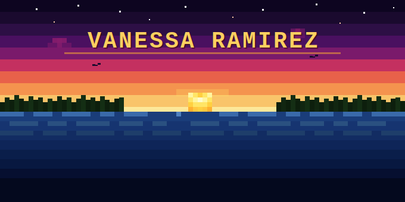

<div align="center">

<!-- ANIMATED FLOWER HEADER -->


<br/>

<div align="center"></div>


<!-- ABOUT ME -->
<div align="left">

###  A little more about me...  

</div>

<br/>

<div align="center">
<table border="0" cellpadding="0" cellspacing="0" width="80%">
<tr>
<td align="left">

```
┌─────────────────────────────────────────────────────┐
│  vanessa@dev ~ $  cat about.txt                     │
├─────────────────────────────────────────────────────┤
│                                                     │
│  CS student at Santa Monica College, transferring   │
│  Fall 2026                                          │
│                                                     │
│  Off-screen: bouldering, hiking, baseball, and      │
│  building Metal Earth models piece by piece.        │
│                                                     │
│  I like hard problems. On a screen and off one.     │
│                                                     │
└─────────────────────────────────────────────────────┘
```

</td>
</tr>
</table>
</div>

<br/>

<div align="center"></div>

<br/>

<!-- TECH STACK -->
<div align="left">
  
### Languages

<br/>

<a href="https://www.python.org"></a>&nbsp;
<a href="https://cplusplus.com"></a>&nbsp;
<a href="https://www.java.com"></a>&nbsp;
<a href="https://developer.mozilla.org/en-US/docs/Web/JavaScript"></a>&nbsp;
<a href="https://developer.apple.com/swift"></a>
<a href="https://www.w3schools.com/c/"></a>&nbsp;
<a href="https://developer.mozilla.org/en-US/docs/Web/CSS"></a>&nbsp;

<br/><br/>

### Tools & Frameworks

<br/>

<a href="https://react.dev"></a>&nbsp;
<a href="https://www.postgresql.org"></a>&nbsp;
<a href="https://supabase.com"></a>&nbsp;
<a href="https://www.figma.com"></a>&nbsp;
<a href="https://nodejs.org"></a>&nbsp;
<a href="https://vitejs.dev"></a>&nbsp;
<a href="https://vercel.com"></a>&nbsp;
<a href="https://developer.apple.com/xcode"></a>&nbsp;

<br/>

<div align="center"></div>

<br/>

<!-- GITHUB STATS -->
<div align="center">

**` stats `**
<br/>


&nbsp;&nbsp;


<br/><br/>


</div>
<br/>
<div align="center"></div>
<br/>

<picture>
  <source media="(prefers-color-scheme: dark)" srcset="https://raw.githubusercontent.com/vanessaxramirez/vanessaxramirez/output/github-contribution-grid-snake-dark.svg">
  <source media="(prefers-color-scheme: light)" srcset="https://raw.githubusercontent.com/vanessaxramirez/vanessaxramirez/output/github-contribution-grid-snake.svg">
  
</picture>

<br/>
<div align="center"></div>
<br/>

<br/>

<!-- CONNECT -->
<div align="left">

### Let's Connect

<br/>

<a href="https://github.com/vanessaxramirez"></a>&nbsp;
<a href="https://linkedin.com/in/vanessairamirez"></a>

</div>

<div align="center">
  


</div>

<br/>

<!-- FOOTER -->

